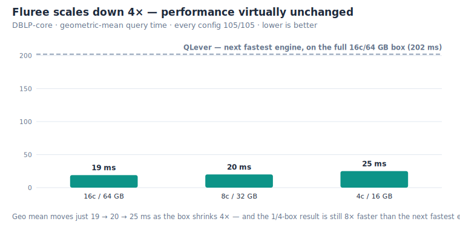

# benchmark-db

Reproducible RDF / SPARQL benchmarks for [Fluree](https://labs.flur.ee), run head-to-head
against other engines on **identical data and hardware**. Every benchmark is
self-contained under [`benchmarks/`](benchmarks/); they share one query runner and one
report generator under [`common/`](common/). All engines run **natively** (no Docker,
matching the SPARQLoscope paper's recommendation), with each engine's result cache
disabled or cleared per query so every run actually re-executes.

The current suite is **[SPARQLoscope](https://github.com/ad-freiburg/sparqloscope)** —
105 SPARQL 1.1 queries probing joins, aggregates, property paths, filters, string
functions, and large result sets — run at three dataset scales (561 M → 1.57 B → 8.19 B
triples).

---

## Headline — DBLP-core: 7 engines, one box, fair fight

The flagship run: the full SPARQLoscope suite over **DBLP-core** (~561 M triples) with
**all seven engines on the same machine** (AWS `m7a.4xlarge`, 16 c / 64 GB) so the
comparison is purely engine-vs-engine. **Fluree leads every aggregate** and is one of
only two engines (with QLever) to answer all 105 queries.


| metric (lower = faster) | **Fluree** | QLever | Virtuoso | MillenniumDB | Jena | Oxigraph | Blazegraph |
|---|---|---|---|---|---|---|---|
| **queries passed** | **105/105** | 105/105 | 102/105 | 103/105 | 69/105 | 36/105 | 3/105 |
| **geo mean** | **124 ms (1.0×)** | 199 ms (1.6×) | 611 ms (4.9×) | 1,565 ms (12.6×) | 5,649 ms (45.4×) | 6,042 ms (48.6×) | 20.5 s (164.9×) |
| **arith mean** | **981 ms (1.0×)** | 1,986 ms (2.0×) | 7,445 ms (7.6×) | 12.2 s (12.5×) | 51.4 s (52.4×) | 22.6 s (23.0×) | 20.5 s (20.9×) |
| **median** | **69 ms (1.0×)** | 331 ms (4.8×) | 1,236 ms (17.9×) | 4,070 ms (59.0×) | 14.0 s (202.6×) | 4,964 ms (71.9×) | 20.5 s (297.5×) |

→ **[Full DBLP-core report](benchmarks/sparqloscope/reports/dblp-core/REPORT.md)** ·
[per-engine raw TSVs](benchmarks/sparqloscope/reports/dblp-core/engines/) ·
[run metadata & setup facts](benchmarks/sparqloscope/reports/dblp-core/meta.json)

> Fluree is the official **v4.0.5** release (installed via the GitHub releases shell
> installer). The other six engines were measured on the same box; the small
> box-to-box variance does not change the ranking — see the report caveats.

---

## Fluree scales down 4× and still beats the field

We then re-ran Fluree alone on progressively smaller boxes. **Even at one-quarter the
cores and RAM (4 c / 16 GB), Fluree answers all 105 queries and is still faster than
the second-place engine running on the full 16 c / 64 GB box** — 1.9× on arith mean,
1.4× on geo mean, 3.8× on median.



| Fluree config | cores | RAM | passed | arith | median | geo |
|---|---|---|---|---|---|---|
| 16c / 64 GB (full) | 16 | 64 GB | 105/105 | 981 ms | 69 ms | 124 ms |
| 16c / 32 GB | 16 | 32 GB | 105/105 | 1,043 ms | 69 ms | 123 ms |
| 8c / 32 GB | 8 | 32 GB | 105/105 | 1,028 ms | 68 ms | 132 ms |
| 8c / 16 GB | 8 | 16 GB | 105/105 | 1,044 ms | 69 ms | 132 ms |
| **4c / 16 GB (¼ box)** | **4** | **16 GB** | **105/105** | **1,062 ms** | **87 ms** | **144 ms** |
| _QLever, full 16c/64 GB (for reference)_ | 16 | 64 GB | 105/105 | _1,986 ms_ | _331 ms_ | _199 ms_ |

→ **[Resource-scaling bench](benchmarks/sparqloscope/reports/dblp-core/fluree-scaling/)**
(per-config raw TSVs + findings)

---

## All runs at a glance

Fluree leads every aggregate at all three scales, and stays ~**1.6–1.7× faster than the
next-best engine (QLever) on geo mean** from 561 M to 8.19 B triples.

| benchmark | triples | engines | box | Fluree passed | Fluree geo (vs next best) | report |
|---|---|---|---|---|---|---|
| **DBLP-core** | 561 M | 7 | `m7a.4xlarge` 16c/64 GB | **105/105** | **124 ms** (QLever 1.6×) | [report](benchmarks/sparqloscope/reports/dblp-core/REPORT.md) |
| **DBLP-KG** | 1.57 B | 2 (Fluree, QLever) | `r7a.4xlarge` 16c/128 GB | **105/105** | **227 ms** (QLever 1.6×) | [report](benchmarks/sparqloscope/reports/dblp-kg/REPORT.md) |
| **Wikidata-truthy** | 8.19 B | 4 | `r7a.16xlarge` 64c/512 GB | **94/105** | **994 ms** (QLever 1.7×) | [report](benchmarks/sparqloscope/reports/wikidata-truthy/REPORT.md) |

_Wikidata-truthy is the hardest scale (8.19 B triples); passed-counts fall for every
engine there — Fluree leads on coverage (94/105) as well as speed._

At the 8.19 B scale the same ordering holds — Fluree fastest on geo mean, QLever next:


---

## Reproduce it

Datasets are pinned and published to **`s3://fluree-benchmark-data/`**
(`dblp-core/`, `dblp-kg/`, `wikidata-truthy/`) so you don't have to re-derive them;
the per-dataset notes under [`benchmarks/sparqloscope/datasets/`](benchmarks/sparqloscope/datasets/)
record exact sources, versions, and checksums.

```bash
# 1. install Fluree (official v4.0.5 release — native binary, no source build)
curl --proto '=https' --tlsv1.2 -LsSf \
  https://github.com/fluree/db/releases/latest/download/fluree-db-cli-installer.sh | sh

# 2. load a dataset, start the server, then run the suite
common/run_benchmark.sh --endpoint http://localhost:8090/v1/fluree/query/dblp:main \
  -r 3 -w 1 -t 180 -o benchmarks/sparqloscope/reports/dblp-core/engines/fluree.tsv

# 3. (re)generate a report and the headline charts
python3 common/generate_report.py benchmarks/sparqloscope/reports/dblp-core/
python3 common/make_charts.py
```

- **Native setup for every engine:** [`common/engine-setup/`](common/engine-setup/)
  ([Fluree](common/engine-setup/fluree.md) ·
  [QLever](common/engine-setup/qlever.md) ·
  [Virtuoso](common/engine-setup/virtuoso.md) ·
  [MillenniumDB](common/engine-setup/millenniumdb.md) ·
  [Jena](common/engine-setup/jena.md) ·
  [Oxigraph](common/engine-setup/oxigraph.md) ·
  [Blazegraph](common/engine-setup/blazegraph.md))
- **Query runner:** [`common/run_benchmark.sh`](common/run_benchmark.sh) —
  warmup + median-of-N, per-query timeout/budget, body or form POST.
- **Report + chart generators:** [`common/generate_report.py`](common/generate_report.py),
  [`common/summarize.py`](common/summarize.py), [`common/make_charts.py`](common/make_charts.py).

## Methodology notes

- **Native, not Docker** — containerization distorts results (per the SPARQLoscope paper).
- **No warm result cache** — each engine's result cache is disabled or cleared per query,
  so every timed run re-executes (stricter than the paper's warm-cache protocol).
- **1 warmup + median of 3 runs**, per-query timeout (180 s for DBLP-core, 300 s for the
  billion-scale runs).
- **Engine-vs-engine on one box per dataset** — absolute times are box-specific and not
  bit-comparable to the published SPARQLoscope table (different dumps/dates). See each
  report's caveats for the precise dataset version, deviations, and per-engine notes.

## Repo layout

```
benchmarks/
  sparqloscope/
    queries/            105 SPARQL 1.1 query files
    datasets/           per-dataset source/version/checksum notes
    reports/
      dblp-core/        7-engine same-box run (REPORT.md, meta.json, engines/*.tsv,
                        fluree-scaling/)
      dblp-kg/          1.57 B-triple Fluree vs QLever
      wikidata-truthy/  8.19 B-triple 4-engine run
common/
  run_benchmark.sh      generic SPARQL benchmark runner
  generate_report.py    meta.json + engines/*.tsv -> REPORT.md
  summarize.py          raw TSV -> per-query summary
  make_charts.py        headline SVG charts (this README)
  engine-setup/         native install/load/serve notes per engine
assets/                 generated charts
```
