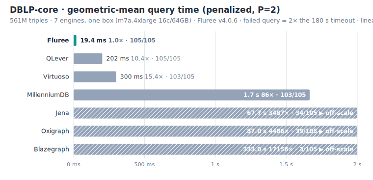
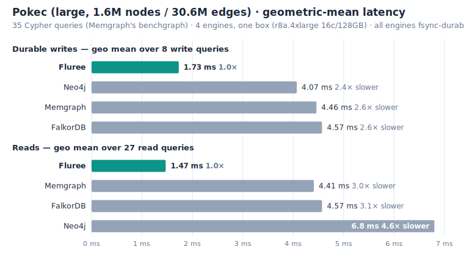
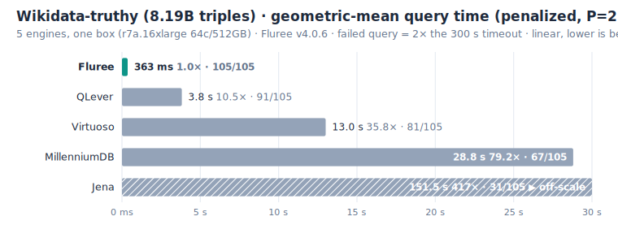

# benchmark-db

Reproducible benchmarks for [Fluree](https://labs.flur.ee), run head-to-head against other
engines on **identical data and hardware**. Every benchmark is self-contained under
[`benchmarks/`](benchmarks/). Most share one SPARQL query runner and report generator under
[`common/`](common/); the property-graph suite has its own multi-engine Cypher runner. All
engines run **natively** (no Docker, matching the SPARQLoscope paper's recommendation), with
each engine's result cache disabled or cleared per query so every run actually re-executes.

Two families:

- **RDF / SPARQL** — **[SPARQLoscope](https://github.com/ad-freiburg/sparqloscope)**
  (105 SPARQL 1.1 queries probing joins, aggregates, property paths, filters, string
  functions, large result sets) at two scales (561 M → 8.19 B triples), plus the
  **[Wikidata Graph Pattern Benchmark](benchmarks/wgpb/)** (WGPB, 850 basic graph pattern
  queries) on the full 21.5 B-triple Wikidata all-dump.
- **Property graph / Cypher** — **[benchgraph / Pokec](benchmarks/benchgraph/)**
  (Memgraph's published Neo4j-comparison suite) run through Fluree's **Cypher / Bolt**
  surface vs native Memgraph, Neo4j, and FalkorDB.

---

## DBLP-core: 7 engines, one box

The full SPARQLoscope suite over **DBLP-core** (~561 M triples) with
**all seven engines on the same machine** (AWS `m7a.4xlarge`, 16 c / 64 GB) so the
comparison is purely engine-vs-engine. **Fluree leads every aggregate** and is one of
only two engines (with QLever) to answer all 105 queries.



| metric (lower = faster) | **Fluree** | QLever | Virtuoso | MillenniumDB | Jena | Oxigraph | Blazegraph |
|---|---|---|---|---|---|---|---|
| **queries passed** | **105/105** | 105/105 | 103/105 | 103/105 | 34/105 | 39/105 | 3/105 |
| **geo mean (P=2)** | **17.5 ms (1.0×)** | 202.4 ms (11.5×) | 299.7 ms (17.1×) | 1,664.2 ms (95×) | 67.7 s (3856×) | 87.0 s (4961×) | 332.9 s (18971×) |
| **geo mean (P=10)** | **17.5 ms (1.0×)** | 202.4 ms (11.5×) | 309.1 ms (17.6×) | 1,716.0 ms (98×) | 200.9 s (11449×) | 239.4 s (13642×) | 1,589.5 s (90593×) |
| **median (passed only)** | **26.6 ms (1.0×)** | 310.3 ms (11.7×) | 326.0 ms (12.3×) | 3,894.5 ms (147×) | 4,540.7 ms (171×) | 5,089.9 ms (192×) | 23.2 s (871×) |

_The geo means follow the [SPARQLoscope paper](https://ad-publications.cs.uni-freiburg.de/ISWC_sparqloscope_BKTU_2025.pdf)'s
official aggregate: a failed or timed-out query counts as 2× (P=2) or 10× (P=10) the
180 s timeout, so every engine is scored on the same 105 queries._

→ **[Full DBLP-core report](benchmarks/sparqloscope/reports/dblp-core/REPORT.md)** ·
[per-engine raw TSVs](benchmarks/sparqloscope/reports/dblp-core/engines/) ·
[run metadata & setup facts](benchmarks/sparqloscope/reports/dblp-core/meta.json)

> Fluree is **v4.1.2** (native source build). The other six engines were
> measured on the same box; the small box-to-box variance does not change the ranking —
> see the report caveats.

---

## Property graph — Pokec: Fluree Cypher vs Memgraph, Neo4j & FalkorDB

Fluree also speaks **Cypher**, so we ran Memgraph's own
**[benchgraph](https://memgraph.com/benchgraph)** suite (35 Cypher queries over the Pokec
social network) head-to-head against native **Memgraph 3.11.0**, **Neo4j 5.26.28**, and
**FalkorDB 4.18.11** on one `r8a.4xlarge`. Each engine is measured over the transport its
users actually use — Fluree over HTTP, Memgraph and Neo4j over Bolt, FalkorDB over native
RESP. It is a **read _and_ write** benchmark, so writes come first. All four engines answer
**35/35 at every scale**, return **byte-identical result sets**, and are held to the **same
per-commit durability contract** — every commit is fsynced. (Memgraph's *published*
sub-millisecond writes come from a non-durable mode that acks a commit before it hits disk;
that is not a contract a real database of record would run on, so we hold all four to durable
writes.)



Geometric mean, ms — lower is faster. The last three columns state how much faster (or
slower) Fluree is than each engine. **Bold = fastest in the row.**

**Durable writes** (the headline — Fluree wins outright at every scale):

| scale (nodes / edges) | Fluree v4.1.2 | Memgraph | Neo4j | FalkorDB | vs Memgraph | vs Neo4j | vs FalkorDB |
|---|---|---|---|---|--:|--:|--:|
| small — 10 k / 122 k | **1.32 ms** | 3.03 ms | 1.76 ms | 2.93 ms | 2.30× faster | 1.33× faster | 2.22× faster |
| medium — 100 k / 1.8 M | **1.27 ms** | 3.39 ms | 2.94 ms | 3.36 ms | 2.66× faster | 2.31× faster | 2.64× faster |
| large — 1.6 M / 30.6 M | **1.73 ms** | 4.46 ms | 4.07 ms | 4.57 ms | 2.57× faster | 2.35× faster | 2.63× faster |

**Read-only** (Fluree fastest at every scale):

| scale (nodes / edges) | Fluree v4.1.2 | Memgraph | Neo4j | FalkorDB | vs Memgraph | vs Neo4j | vs FalkorDB |
|---|---|---|---|---|--:|--:|--:|
| small — 10 k / 122 k | **0.60 ms** | 0.93 ms | 1.43 ms | 0.61 ms | 1.56× faster | 2.39× faster | 1.02× faster |
| medium — 100 k / 1.8 M | **1.23 ms** | 2.36 ms | 4.99 ms | 1.75 ms | 1.92× faster | 4.05× faster | 1.42× faster |
| large — 1.6 M / 30.6 M | **1.47 ms** | 4.41 ms | 6.80 ms | 4.57 ms | 3.01× faster | 4.64× faster | 3.12× faster |

**Writes:** with every engine fsync-durable, Fluree's per-commit write path is **2.3–2.7×
faster than Memgraph and FalkorDB and 1.3–2.4× faster than Neo4j** at every scale.
**Reads:** Fluree is the **fastest engine at every scale** — **1.6–3.0× faster** than
Memgraph, **2.4–4.6×** than Neo4j, and **1.0–3.1×** than FalkorDB (tied with FalkorDB on the
tiny small graph, pulling away with scale). The blend still hides a clean **division of
strengths**: **Fluree owns the analytical half** — whole-graph aggregates stay ~O(1) via
index directories and are **100–720× faster than the scanners at large** — while **FalkorDB
keeps a narrow edge in raw traversal** (fixed-hop expansions and neighbourhoods **~1.2–1.5×
faster** on the category geo-mean, down from ~2–3× in prior builds), though **Fluree now
overtakes it on the deepest hops** (`expansion_3`, `expansion_4`) at large. Memgraph is the
balanced in-memory generalist (and shortest-path leader at small/medium scales); Neo4j is
consistently slowest.

> **Note — this is a big-box run; the real differentiator is memory.** FalkorDB and Memgraph
> hold the entire graph in RAM (FalkorDB is compact — 1.29 GB for large — but there is no
> disk paging: an over-sized graph OOMs). Fluree is disk-backed with an on-disk index, so it
> degrades gracefully where the in-memory engines hit a cliff. On smaller machines, where the
> graph approaches or exceeds RAM, that architectural gap — not these on-par big-box read
> numbers — is where the engines diverge. A smaller-machine run is the natural next step.

→ **[Full Pokec report](benchmarks/benchgraph/reports/pokec/REPORT.md)** ·
[per-engine raw TSVs](benchmarks/benchgraph/reports/pokec/engines/) ·
[per-query medians](benchmarks/benchgraph/reports/pokec/summary.tsv) ·
[run metadata](benchmarks/benchgraph/reports/pokec/meta.json)

> Fluree is the **v4.1.2** release (build `13a78d2a`), measured through its Cypher
> surface over HTTP end to end. All four engines run **natively** on the one box (FalkorDB as
> `redis-server` + module, not the Docker image), each over its real-world client transport
> (Fluree HTTP, Memgraph/Neo4j Bolt, FalkorDB native RESP), and all held to per-commit fsync
> durability. All three scales were measured together with shared params (fresh pristine load
> each). See the report's division-of-strengths analysis and caveats.

---

## All runs at a glance

Fluree leads every aggregate on every run. On the SPARQLoscope penalized geo mean
(P=2), Fluree is **11.5× faster than the next fastest engine (QLever) on
DBLP-core (561 M) and 10.4× on Wikidata-Truthy (8.19 B)**; on Pokec it is the
**fastest engine on both reads and durable writes at every scale**.

| benchmark | data | engines | box | Fluree passed | Fluree geo mean (vs next fastest) | report |
|---|---|---|---|---|---|---|
| **DBLP-core** | 561 M triples | 7 | `m7a.4xlarge` 16c/64 GB | **105/105** | **17.5 ms** (QLever 11.5×) | [report](benchmarks/sparqloscope/reports/dblp-core/REPORT.md) |
| **Wikidata-truthy** | 8.19 B triples | 5 | `r7a.16xlarge` 64c/512 GB | **105/105** | **367.4 ms** (QLever 10.4×) | [report](benchmarks/sparqloscope/reports/wikidata-truthy/REPORT.md) |
| **WGPB** (Wikidata all-dump) | 21.5 B triples | 1 (Fluree only) | `r7a.8xlarge` 32c/256 GB | **850/850** | **43 ms** | [report](benchmarks/wgpb/reports/wikidata-all/REPORT.md) |
| **Pokec** (benchgraph, Cypher) | 30.6 M edges | 4 | `r8a.4xlarge` 16c/128 GB | **35/35** | reads **1.47 ms** (Memgraph 3.0×) · writes **1.73 ms** (Neo4j 2.4×) | [report](benchmarks/benchgraph/reports/pokec/REPORT.md) |

_The SPARQL rows are the SPARQLoscope penalized geo mean (P=2). Wikidata-truthy is the
hardest SPARQLoscope scale (8.19 B triples); passed-counts fall for every other engine
there — Fluree is the only engine to answer all 105 queries, at both scales. The WGPB
row is the separate 850-query graph-pattern benchmark on the full 21.5 B-triple Wikidata
all-dump (794 GB index, ~3× RAM): 100% completion, 0 timeouts. The Pokec row is the
Cypher suite's large scale (read / durable-write geo means); Fluree is fastest on both
at every scale._

At the 8.19 B scale the same ordering holds — Fluree fastest on geo mean, QLever next:



---

## Reproduce it

Datasets are pinned and published to **`s3://fluree-benchmark-data/`**
(`dblp-core/`, `wikidata-truthy/`, `wikidata-all/`) so you don't have to re-derive them;
the per-dataset notes under [`benchmarks/sparqloscope/datasets/`](benchmarks/sparqloscope/datasets/)
record exact sources, versions, and checksums.

```bash
# 1. install Fluree (official release, v4.1.2 or later — native binary, no source build).

curl --proto '=https' --tlsv1.2 -LsSf \
  https://github.com/fluree/db/releases/latest/download/fluree-db-cli-installer.sh | sh

# 2. load a dataset, start the server, then run the suite
common/run_benchmark.sh --endpoint http://localhost:8090/v1/fluree/query/dblp:main \
  -r 3 -w 1 -t 180 -o benchmarks/sparqloscope/reports/dblp-core/engines/fluree.tsv

# 3. (re)generate a report and the headline charts
python3 common/generate_report.py benchmarks/sparqloscope/reports/dblp-core/
python3 common/make_charts.py
```

- **Native setup for every engine:** [`common/engine-setup/`](common/engine-setup/)
  ([Fluree](common/engine-setup/fluree.md) ·
  [QLever](common/engine-setup/qlever.md) ·
  [Virtuoso](common/engine-setup/virtuoso.md) ·
  [MillenniumDB](common/engine-setup/millenniumdb.md) ·
  [Jena](common/engine-setup/jena.md) ·
  [Oxigraph](common/engine-setup/oxigraph.md) ·
  [Blazegraph](common/engine-setup/blazegraph.md))
- **Query runner:** [`common/run_benchmark.sh`](common/run_benchmark.sh) —
  warmup + median-of-N, per-query timeout/budget, body or form POST.
- **Report + chart generators:** [`common/generate_report.py`](common/generate_report.py),
  [`common/summarize.py`](common/summarize.py), [`common/make_charts.py`](common/make_charts.py).

## Methodology notes

- **Native, not Docker** — containerization distorts results (per the SPARQLoscope paper).
- **No warm result cache** — each engine's result cache is disabled or cleared per query,
  so every timed run re-executes (stricter than the paper's warm-cache protocol).
- **1 warmup + median of 3 runs**, per-query timeout (180 s for DBLP-core, 300 s for the
  billion-scale SPARQLoscope runs, 120 s for WGPB).
- **Engine-vs-engine on one box per dataset** — absolute times are box-specific and not
  bit-comparable to the published SPARQLoscope table (different dumps/dates). See each
  report's caveats for the precise dataset version, deviations, and per-engine notes.

## Repo layout

```
benchmarks/
  sparqloscope/
    queries/            105 SPARQL 1.1 query files
    datasets/           per-dataset source/version/checksum notes
    reports/
      dblp-core/        7-engine same-box run (REPORT.md, meta.json, engines/*.tsv)
      wikidata-truthy/  8.19 B-triple 5-engine run (Blazegraph excluded)
  wgpb/
    queries/            850 WGPB basic-graph-pattern queries (17 shapes x 50)
    reports/
      wikidata-all/     21.5 B-triple full all-dump run (Fluree)
  benchgraph/           property-graph / Cypher (Memgraph's Pokec suite)
    queries/            35 Neo4j-portable Cypher queries (pokec.py)
    bench_runner.py     multi-engine Cypher runner (fluree HTTP / memgraph / neo4j Bolt / falkordb RESP)
    queries-falkordb/   FalkorDB path-query overrides (shortestPath in WITH/RETURN)
    reports/
      pokec/            3-scale Fluree-vs-Memgraph-vs-Neo4j-vs-FalkorDB run (REPORT.md,
                        meta.json, summary.tsv, engines/*.tsv)
common/
  run_benchmark.sh      generic SPARQL benchmark runner
  generate_report.py    meta.json + engines/*.tsv -> REPORT.md
  summarize.py          raw TSV -> per-query summary
  make_charts.py        headline SVG charts (this README)
  engine-setup/         native install/load/serve notes per engine
assets/                 generated charts
```
