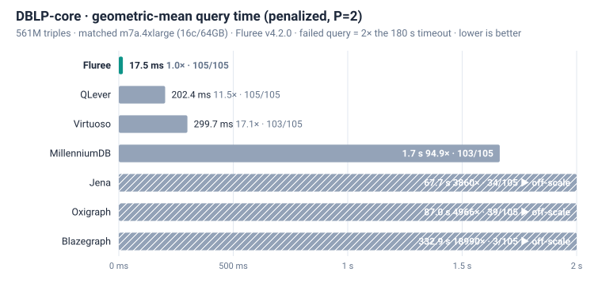

# benchmark-db

Reproducible database benchmarks for [Fluree](https://labs.flur.ee) and other engines.
Each comparison records its dataset, hardware, engine versions, query timings and
setup commands. Engines run natively, with query-result caches disabled.

## DBLP-core: 7 engines, matched hardware

**Fluree v4.2.0 answers all 105 queries with a 17.5 ms geometric mean** on
561 million triples. QLever averages 202.4 ms and Virtuoso 299.7 ms—**11.5× and
17.1× Fluree's latency**, respectively. All seven engines use matching AWS
`m7a.4xlarge` hardware (16 cores / 64 GB).



| metric (lower = faster) | **Fluree v4.2.0** | QLever | Virtuoso | MillenniumDB | Jena | Oxigraph | Blazegraph |
|---|---|---|---|---|---|---|---|
| **queries passed** | **105/105** | 105/105 | 103/105 | 103/105 | 34/105 | 39/105 | 3/105 |
| **geo mean (P=2)** | **17.5 ms (1.0×)** | 202.4 ms (11.5×) | 299.7 ms (17.1×) | 1,664.2 ms (94.9×) | 67.7 s (3859.8×) | 87.0 s (4965.6×) | 332.9 s (18990.3×) |

_Geometric mean uses all 105 queries; failures count as 2× the 180-second timeout
(SPARQLoscope P=2). Lower is faster. The full report includes P=10 and per-query results._

→ **[Full DBLP-core report](benchmarks/sparqloscope/reports/dblp-core/REPORT.md)** ·
[per-engine raw TSVs](benchmarks/sparqloscope/reports/dblp-core/engines/) ·
[run metadata & setup facts](benchmarks/sparqloscope/reports/dblp-core/meta.json)

Fluree: official v4.2.0 binary, measured September 7, 2026. Other engines:
June 11, 2026, on the same instance class and dataset.
[Reproduce the Fluree run](benchmarks/sparqloscope/reports/dblp-core/v420-release/REPORT.md).

## Other benchmarks

These are separate measurements; each report records the engine versions and
configuration used. They have not been refreshed with the DBLP v4.2.0 run.

| Benchmark | Dataset | Fluree completed | Fluree geometric mean | Comparison |
|---|---|---:|---:|---|
| [Wikidata-truthy / SPARQLoscope](benchmarks/sparqloscope/reports/wikidata-truthy/REPORT.md) | 8.19 B triples | 105/105 | 367.4 ms | QLever: 10.4× the latency |
| [Wikidata Graph Pattern Benchmark](benchmarks/wgpb/reports/wikidata-all/REPORT.md) | 21.5 B triples | 850/850 | 43 ms | Fluree only |
| [Pokec / Cypher](benchmarks/benchgraph/reports/pokec/REPORT.md) | 1.6 M nodes / 30.6 M edges | 35/35 | 1.47 ms, reads | Memgraph: 4.41 ms; Neo4j: 6.80 ms; FalkorDB: 4.57 ms |

SPARQLoscope uses the penalized P=2 mean. The graph-pattern and Cypher benchmarks
use their own query sets and protocols. Historical Pokec write measurements used
different durability settings across engines and are not an equal-durability comparison.

## Reproduce DBLP-core

On Ubuntu 24.04 x86_64, with curl, pigz, Python 3, coreutils and xz-utils installed:

```bash
bash benchmarks/sparqloscope/reproduce-dblp-fluree.sh /path/to/new-run
```

The script installs the pinned v4.2.0 binary, verifies binary and dataset checksums,
imports a fresh ledger, runs all 105 queries, and saves timings and responses.
See the [run instructions](benchmarks/sparqloscope/reports/dblp-core/v420-release/REPORT.md)
for hardware requirements. Dataset sources are pinned under
[SPARQLoscope datasets](benchmarks/sparqloscope/datasets/), with copies in
`s3://fluree-benchmark-data/`.

To regenerate the DBLP report and SVG from the committed timing TSVs:

```bash
python3 common/generate_report.py benchmarks/sparqloscope/reports/dblp-core
python3 -c 'from common.make_charts import make_dblp_chart; make_dblp_chart()'
```

- [Native engine setup](common/engine-setup/)
- [SPARQL query runner](common/run_benchmark.sh): warmup, timed requests, timeout, saved responses.
- [Report generator](common/generate_report.py): aggregate, category and per-query comparisons.
- [Chart generator](common/make_charts.py): the DBLP chart reads the published TSVs and version metadata.

## Method

DBLP uses one warmup followed by the median of three measured requests per query,
with a 180-second timeout. HTTP timings include response transfer. Other engines'
protocol differences, including single-run or cold-cache measurements, are recorded
in the full report. Matched instance hardware does not eliminate host variation.

The DBLP and Wikidata query sets come from
[SPARQLoscope](https://github.com/ad-freiburg/sparqloscope). The property-graph suite
uses [benchgraph](https://memgraph.com/benchgraph) queries over Pokec, through
Fluree's HTTP Cypher endpoint and the other engines' native client protocols.

## Repository layout

- `benchmarks/sparqloscope/`: query sets, pinned datasets and multi-engine reports.
- `benchmarks/wgpb/`: 850 Wikidata graph-pattern queries and results.
- `benchmarks/benchgraph/`: Cypher/Pokec runner, queries and results.
- `common/`: SPARQL runner, report/chart generators and engine setup.
- `assets/`: generated SVG charts.
