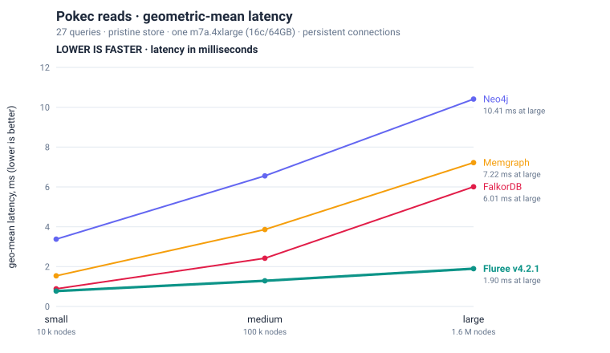
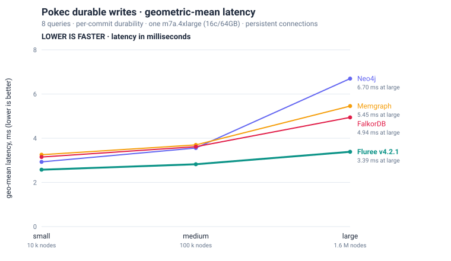

# Pokec (benchgraph) — Fluree vs Memgraph vs Neo4j vs FalkorDB

**Fluree v4.2.1 leads both read and durable-write geometric means at every scale.**
At large (1.6 M nodes / 30.6 M edges), reads are **3.17–5.49× faster** and durable
writes **1.46–1.98× faster** than FalkorDB, Memgraph and Neo4j.

Measured September 11, 2026, on one AWS `m7a.4xlarge` (16 cores / 64 GB, Ubuntu 24.04).
The 35-query [benchgraph](https://memgraph.com/benchgraph) suite runs through Fluree's
HTTP Cypher endpoint, Memgraph 3.11.0 and Neo4j 5.26.30 Community over Bolt, and
FalkorDB 4.20.4 over RESP. Each client reuses a persistent connection. All four engines
use per-commit durable writes, with flush behavior checked by syscall traces (§5).
The measured Fluree source build is `0f26d9d6a`; its version string is recorded in §4.

All engines **complete 35/35 queries at every scale** without execution errors. This
is not a claim of identical results: two reads have known result-count differences at
small/medium scale, including a Fluree relationship-uniqueness bug (§5). Timings for
those queries remain in the headline means; §5 also shows the effect of excluding them.

**Dataset:** one `:User` label, one `Friend` edge type, no edge properties; small
10,000 / 121,716 nodes/edges, medium 100,000 / 1,768,515, large 1,632,803 / 30,622,564.
Single-client latency; median of 5 measured requests (large: 3), seed 42, shared parameters.

Results are in §1, category and individual-query analysis in §2, dataset/setup details in
§3–§4, methodology and caveats in §5, and reproduction instructions in §6.

## 1. Query benchmark

Geometric means of per-query medians, separately over **8 write queries and 27 read
queries**. Every engine uses per-commit durable writes. Reads are measured on a pristine
store; writes come from a separate pass (§5). **Lower milliseconds are faster.**
The **Fluree vs X** columns give latency ratios; bold marks the lowest value in a row.





Each line shows an engine's geometric mean at each measured scale. The tables carry the
same values. Charts are generated from [`summary.tsv`](summary.tsv) by
[`make_scaling_charts.py`](make_scaling_charts.py).

### Writes — geometric mean (ms)

| scale | n | Fluree | Memgraph | Neo4j | FalkorDB | Fluree vs Memgraph | Fluree vs Neo4j | Fluree vs FalkorDB |
| --- | --: | --- | --- | --- | --- | --: | --: | --: |
| small | 8 | **2.57** | 3.25 | 2.93 | 3.15 | 1.26× faster | 1.14× faster | 1.22× faster |
| medium | 8 | **2.82** | 3.70 | 3.56 | 3.62 | 1.31× faster | 1.26× faster | 1.28× faster |
| large | 8 | **3.39** | 5.45 | 6.70 | 4.94 | 1.61× faster | 1.98× faster | 1.46× faster |

### Reads — geometric mean (ms)

| scale | n | Fluree | Memgraph | Neo4j | FalkorDB | Fluree vs Memgraph | Fluree vs Neo4j | Fluree vs FalkorDB |
| --- | --: | --- | --- | --- | --- | --: | --: | --: |
| small | 27 | **0.77** | 1.54 | 3.38 | 0.88 | 1.99× faster | 4.37× faster | 1.14× faster |
| medium | 27 | **1.29** | 3.86 | 6.56 | 2.42 | 3.00× faster | 5.09× faster | 1.88× faster |
| large | 27 | **1.90** | 7.22 | 10.41 | 6.01 | 3.81× faster | 5.49× faster | 3.17× faster |

## 2. Performance by query category

The read geo-mean is a blend of two very different regimes. Breaking the 27 read queries into
categories (geo mean, ms):

### Reads by category — geometric mean (ms)

**small**

| category | n | Fluree | Memgraph | Neo4j | FalkorDB | winner |
|---|--:|---|---|---|---|---|
| Point lookup | 7 | 0.38 | 0.31 | 0.93 | **0.21** | FalkorDB |
| Aggregate | 5 | **0.43** | 1.98 | 2.97 | 1.63 | Fluree |
| Expansion | 8 | 2.15 | 6.05 | 12.24 | **1.67** | FalkorDB |
| Neighbourhood | 4 | **0.96** | 3.87 | 6.15 | 1.48 | Fluree |
| Shortest path | 3 | 0.51 | **0.31** | 1.25 | 0.85 | Memgraph |

**medium**

| category | n | Fluree | Memgraph | Neo4j | FalkorDB | winner |
|---|--:|---|---|---|---|---|
| Point lookup | 7 | 0.44 | 0.46 | 0.98 | **0.28** | FalkorDB |
| Aggregate | 5 | **0.57** | 16.49 | 16.38 | 13.80 | Fluree |
| Expansion | 8 | 6.23 | 17.98 | 34.72 | **4.69** | FalkorDB |
| Neighbourhood | 4 | **1.49** | 5.03 | 6.73 | 2.21 | Fluree |
| Shortest path | 3 | 0.77 | **0.57** | 1.37 | 3.85 | Memgraph |

**large**

| category | n | Fluree | Memgraph | Neo4j | FalkorDB | winner |
|---|--:|---|---|---|---|---|
| Point lookup | 7 | 0.57 | 0.72 | 1.10 | **0.38** | FalkorDB |
| Aggregate | 5 | **1.55** | 266.40 | 248.22 | 221.47 | Fluree |
| Expansion | 8 | 6.45 | 11.97 | 21.92 | **4.71** | FalkorDB |
| Neighbourhood | 4 | **3.18** | 7.68 | 9.64 | 3.71 | Fluree |
| Shortest path | 3 | **0.85** | 0.90 | 1.52 | 33.90 | Fluree |

**Aggregate queries account for Fluree's largest read advantage.** At large, the five
aggregate queries have a **1.55 ms** geometric mean, versus **221–266 ms** for the other
engines (**143–172× faster**). Fluree's index directories support these aggregates:
`aggregate_with_distinct` takes **0.39 ms vs 221–245 ms**, `count` **0.55 ms vs
159–236 ms**, and `aggregate` **1.83 ms vs 194–229 ms**. Costs still vary with the query
and scale: `min_max_avg` rises from 0.49 ms at small to 12.73 ms at large, where it is
**24–36× faster** than the other engines. The measured category advantage grows with scale.

**Fluree leads deeper unfiltered expansion and neighbourhood reads with returned data.**
At large it leads `expansion_3` (9.15 ms vs FalkorDB's 13.42 ms), `expansion_4`
(31.88 vs 34.71 ms), and both `neighbours_2_with_data` variants. FalkorDB has lower
latency on filtered expansions and shallow hops, giving it the lower expansion category
mean (4.71 vs 6.45 ms). Its point-lookup category mean is also lower (0.38 vs 0.57 ms).
These category gaps are 1.37× and 1.50×, respectively; they are not uniform across queries.

**Fluree has the lowest shortest-path category mean at large**, 0.85 ms versus
Memgraph's 0.90 ms and Neo4j's 1.52 ms. On the individual unfiltered `shortest_path`
query, Neo4j is only **about 6% faster** (2.07 vs 2.19 ms). Memgraph has lower category
means at small and medium. The filtered path queries have semantic differences (§5),
so their timings should be read alongside the correctness notes.

**Durable-write geometric means favor Fluree at every scale:** 1.14–1.26× faster at
small, 1.26–1.31× at medium, and 1.46–1.98× at large. The largest individual win is
`update__vertex_on_property`, a label-less `SET`, at **2.22 ms vs 103–249 ms** at large
(**46–112× faster**). The main gaps are the 100-row `unwind_range_vertex_write` batch
insert (7.40 ms vs FalkorDB's 3.53 ms at large), `create__edge` (7.51 ms vs Neo4j's
2.93 ms), and `create__pattern` (5.10 vs 2.77 ms). Some differences are much smaller:
FalkorDB's large `single_edge_write` takes 3.65 ms versus Fluree's 3.79 ms, about 4% faster.

The overall lead describes this measured query mix. The category tables and appendix
show where it holds and where individual queries have higher latency.

## 3. Dataset & scales

[Pokec](https://snap.stanford.edu/data/soc-Pokec.html) is the Slovak social network used
by Memgraph's published benchgraph. It is a plain property graph — one `:User` node label,
one `Friend` relationship type, **no edge properties** — which makes it a clean read of
node storage, adjacency traversal, and label/property indexing without edge-property
machinery.

| scale | nodes | edges | source |
|---|--:|--:|---|
| small | 10,000 | 121,716 | `pokec_small_import.cypher` |
| medium | 100,000 | 1,768,515 | `pokec_medium_import.cypher` |
| large | 1,632,803 | 30,622,564 | `pokec_large.setup.cypher.gz` |

Datasets come from `deps.memgraph.io` (verbatim Memgraph distribution). The 35 query texts
in [`queries/`](../../queries/) are the **Neo4j-portable branch** of
`memgraph/tests/mgbench/workloads/pokec.py`;
[`query-set.tsv`](../../query-set.tsv) records each query's parameterization and read/write
kind. All engines receive **identical seed vertices** (seed 42) via shared params files, so
every engine runs the same point lookups, expansion roots, and path endpoints. Node and edge
counts were re-verified on every engine at every scale after load (§4); result-set sizes were
cross-checked per query across all four engines, and the two differences found are in §5.

## 4. Engines, setup & load

| | version | transport | durability | in-memory? | install |
|---|---|---|---|---|---|
| **Fluree** | **v4.2.1** (`0f26d9d6a`; binary self-reports `4.2.0`) | HTTP (JSON), keep-alive | per-commit WAL `fdatasync` + on-disk index | **no** (disk-backed + page cache) | source build (`cargo build --release -p fluree-db-cli`) |
| **Memgraph** | 3.11.0 | Bolt 7687 | `--storage-wal-file-flush-every-n-tx=1` (per-commit fsync) | yes | official Docker image, `--network host` |
| **Neo4j** | 5.26.30 Community | Bolt 7687 | durable by default | partly (page cache, disk store) | official Docker image, `--network host` |
| **FalkorDB** | 4.20.4 (graph module `42004`, Redis 8.6.3) | RESP `GRAPH.QUERY` | Redis AOF `appendfsync always` | **yes** (RAM-resident graph) | official Docker image, `--network host` |

Load times (out of the measured path, fresh store per engine per scale):

| | small | medium | large |
|---|--:|--:|--:|
| Fluree (`fluree create --from *.cypher`) | 2 s | 24 s | 441 s |
| Neo4j (`neo4j-admin database import full`) | 1.3 s | 2.4 s | 17.5 s |
| Memgraph (mgconsole replay + `CREATE SNAPSHOT`) | 16 s | 252 s | 4,364 s |
| FalkorDB (`falkordb-bulk-insert`) | 0.3 s | 5 s | 88 s |

- **Fluree** ingests the upstream `.cypher` dump directly — the exact same file Memgraph and
  Neo4j load, no Turtle conversion and no `@vocab` context, bare Cypher names resolve
  directly. Every **measured** query then runs end to end through Fluree's Cypher surface over
  the HTTP API; SPARQL plays no part at query time. Served with `FLUREE_STORAGE_FSYNC=wal`
  and background indexing at the shipped default threshold.
- **Neo4j** is bulk-loaded with `neo4j-admin database import full --id-type=INTEGER` from CSVs
  generated by [`cypher_to_csv.py`](../../cypher_to_csv.py) (typed header
  `id:ID,completion_percentage:int,gender,age:int`), then the `User(id)` index is built and
  awaited with `db.awaitIndexes()`.
- **Memgraph** is loaded by replaying the distribution's Cypher `CREATE` statements
  (`CREATE INDEX ON :User(id)` first), then `CREATE SNAPSHOT`, then a restart with
  `--data-recovery-on-startup=true --storage-wal-file-flush-every-n-tx=1`. The replay used here takes 73 minutes at large.
- **FalkorDB** is loaded with the native bulk loader (`falkordb-bulk-insert 1.2.0`), then
  `CREATE INDEX FOR (u:User) ON (u.id)`. Two image defaults must be lifted before measuring
  (`GRAPH.CONFIG SET RESULTSET_SIZE -1`, `TIMEOUT 0`) — see §5. AOF durability is enabled after
  the bulk load and `aof_enabled:1` confirmed before any timing.

## 5. Methodology & caveats

- **Single-client latency, median of N** — small/medium: 5 runs + 2 warmup; large: 3 runs
  + 1 warmup. Times are wall-clock per query at the client.
- **Per-engine client transport, one connection each.** Each engine is measured over the
  transport its users actually use: **Fluree over its HTTP/JSON API**, **Memgraph and Neo4j
  over Bolt** (official neo4j driver 6.3.0), **FalkorDB over native RESP** (`GRAPH.QUERY` via
  falkordb client 1.7.1). Every client holds **one persistent connection for the whole run**.
  The July 2026 Fluree HTTP client opened a fresh TCP connection per request; this
  run uses the persistent client in [`bench_runner.py`](../../bench_runner.py).
  Transport and full-response transfer remain part of delivered latency.
- **Per-commit durability.** Fluree uses WAL `fdatasync`, Neo4j its default durable
  transaction log, Memgraph `--storage-wal-file-flush-every-n-tx=1`, and FalkorDB
  Redis AOF `appendfsync always`. A separate **40-write pass** (8 queries × 5 runs)
  recorded `fsync`/`fdatasync`/`syncfs` activity in each configuration; see
  [`engines/durability/`](engines/durability/). These aggregate counts support the
  configured flush behavior; they do not substitute for crash-recovery testing.
  The measured Memgraph and FalkorDB images issued no flush syscalls in their default
  configurations during the diagnostic. Those default-mode timings are not included.
- **Clean protocol (reads).** For each scale and each engine: fresh load → warmup reads-only
  pass (discarded) → recorded **reads-only** pass on the still-pristine store → a **separate
  full pass** whose write rows are the canonical writes. Reads precede all mutations;
  writes accumulate mutations within their own pass. This prevents earlier writes from
  changing the store state used for the read measurements.
- **Shared params, all scales.** All three scales were measured for all four engines on this
  one box with shared `params_<scale>.json` (fresh load each), so every engine runs the same
  point lookups, expansion roots and path endpoints.
- **Read-result differences.** Row counts agree across all four engines on all 27 reads
  at large, and on all but two reads at small/medium. Write `result_size` fields are not
  directly comparable: Fluree records a commit receipt as 1, while the other clients
  record 0 for writes without returned rows.

  The two read differences are:
  1. `expansion_3_with_filter` at small, one parameter draw: Fluree and FalkorDB return 3,430
     rows where Neo4j and Memgraph return 3,429. **This one is a Fluree bug, not a tie-break.**
     openCypher uses *relationship isomorphism* — nodes may repeat across the hops of one
     `MATCH` pattern, a relationship may not. The extra row comes from the walk
     `5926 → 5629 → 5926 → 5629`, which reuses its first edge as its third.
     `MATCH (s:User {id:5926})-[r1]->()-[r2]->()-[r3]->(n:User {id:5629}) RETURN count(*)`
     returns 1 on Fluree and 0 on Neo4j; adding `WHERE r1 <> r3` makes Fluree agree. Fluree and
     FalkorDB share the gap; Neo4j and Memgraph enforce the constraint. Impact here is one row
     in 3,430 on one of the five measured small-scale draws, and it is a correctness item, tracked separately.
  2. `shortest_path_with_filter` uses engine-specific query forms. At small `run3`,
     FalkorDB returns zero rows and the other three return one. Its override filters a
     previously selected shortest path, which can differ from a constrained search.
     At medium `run2`–`run4`, Memgraph returns one row while Fluree, Neo4j and FalkorDB
     return zero. The Memgraph override applies an age predicate while traversing;
     the committed timings and row counts do not establish equivalent returned paths.
     Both sets of differences are retained in the raw TSVs.

  The raw files record row counts, not complete result contents; matching counts alone
  do not prove result equality. Excluding both affected query IDs at **every** scale
  leaves 25 reads and preserves Fluree's lowest read geometric mean:

  | scale | Fluree | Memgraph | Neo4j | FalkorDB |
  |---|---:|---:|---:|---:|
  | small | **0.75 ms** | 1.53 ms | 3.31 ms | 0.83 ms |
  | medium | **1.20 ms** | 3.70 ms | 6.26 ms | 2.12 ms |
  | large | **1.76 ms** | 7.39 ms | 10.21 ms | 5.11 ms |

- **FalkorDB image defaults silently truncate.** `falkordb/falkordb:latest` ships
  `RESULTSET_SIZE 10000` and `TIMEOUT 1000` ms. With the cap in place, medium `expansion_4`
  returns exactly 10,000 rows and *looks* fast; the cap must be lifted
  (`GRAPH.CONFIG SET RESULTSET_SIZE -1`) for a like-for-like comparison. Its `User(id)` index
  also builds asynchronously and takes minutes on the 1.6 M-node graph — query plans show a
  label scan until it lands, so the index must be confirmed before timing. Both are handled in
  the run script.
- **FalkorDB path queries.** FalkorDB rejects Neo4j's standalone `MATCH p=shortestPath(...)`;
  the equivalents live in [`queries-falkordb/`](../../queries-falkordb/).
- **Containers, host networking.** Neo4j, Memgraph and FalkorDB run from their official Docker
  images with `--network host` (no docker-proxy hop) and named volumes on the same gp3 volume
  Fluree writes to. Fluree runs natively.
- **Comparison with the previous publication.** The July 2026 v4.1.2 report used an
  `r8a.4xlarge` (Zen 5), a different Fluree connection model, and a different write
  durability implementation. **Correction:** it described Fluree's writes as
  fsync-durable, but v4.1.2 file storage used `tokio::fs::write` without fsync.
  Per-commit durability arrived in `44eb56b53`, before v4.1.6. Those write timings
  therefore excluded the durable flush cost measured here. The hardware, connection,
  and durability changes prevent a direct version-to-version comparison.
- **Not the published Memgraph table.** Memgraph publishes multi-worker throughput on older
  silicon; this is single-client isolated latency on current hardware. Cross-referencing the
  two is not valid.

**Scope.** All graphs fit in the 64 GB machine. This run measures single-client
latency, not concurrent throughput or performance when the graph exceeds RAM. Fluree
uses an on-disk index, but these measurements do not quantify that capacity advantage.

## 6. Reproduce it

The [raw engine TSVs](engines/), [per-query medians](summary.tsv), and [metadata](meta.json)
back the published results. [`gen_report.py`](../../gen_report.py) regenerates the summary
and tables; it does not replace the report's analysis prose.

For the Fluree-only sequence and an explanation of **HTTP connection reuse**, see
[the suite instructions](../../README.md#reproduce-the-published-http-measurements).
`bench_runner.py --engine fluree` uses the built-in persistent HTTP client by default,
including through `run_benchmark.sh`. No additional load-testing package is required.

For the complete comparison, use a dedicated Ubuntu benchmark host with Bash 4+,
Docker, Python 3, curl, gzip, Rust/Cargo, and `strace` for the durability check. The box
scripts recreate their named containers, volumes and Fluree stores. They are intended
for a disposable benchmark machine. Run from a checkout of this repository:

```bash
# Build the exact Fluree source used in these measurements, in a separate checkout.
git clone https://github.com/fluree/db.git "$HOME/pokec-fluree-src"
git -C "$HOME/pokec-fluree-src" checkout 0f26d9d6a
(cd "$HOME/pokec-fluree-src" && cargo build --release -p fluree-db-cli)
export FBIN="$HOME/pokec-fluree-src/target/release/fluree"

cd benchmarks/benchgraph
python3 -m venv "$HOME/pokec-venv"
source "$HOME/pokec-venv/bin/activate"
python3 -m pip install neo4j==6.3.0 falkordb==1.7.1 falkordb-bulk-loader==1.2.0

mkdir -p data
pokec_base=https://s3.eu-west-1.amazonaws.com/deps.memgraph.io/dataset/pokec/benchmark
for scale in small medium; do
  curl -fL -o "data/pokec_${scale}_import.cypher" \
    "$pokec_base/pokec_${scale}_import.cypher"
done
curl -fL -o data/pokec_large.setup.cypher.gz "$pokec_base/pokec_large.setup.cypher.gz"
gzip -dk data/pokec_large.setup.cypher.gz

# Fresh load per engine/scale -> discarded reads1 -> canonical reads2 -> full write pass.
# Uses the committed params_<scale>.json and the persistent HTTP/Bolt/RESP clients.
export OUT="$PWD/results/v421"
bash run-4engine-box.sh
python3 merge_runs.py "$OUT" "$OUT/engines" query-set.tsv
python3 gen_report.py "$OUT/engines" "$OUT" --tables

# Separate diagnostic pass; keep its timings out of the performance results.
bash verify-durability-box.sh
```

The measured images were `memgraph/memgraph:3.11.0`, `neo4j:5.26-community` (resolved
version 5.26.30), and `falkordb/falkordb:latest` (4.20.4 on Redis 8.6.3). The latter two
tags are mutable; check resolved versions against [meta.json](meta.json) when rerunning.
Set `NEO4J_IMAGE` and `FALKORDB_IMAGE` to retained image references if available. The
original image digests were not recorded. Use the pinned Fluree commit above: that
source build's `--version` string is `fluree 4.2.0`, as retained in the metadata.

To regenerate the publication artifacts from the committed measurements without
running any database, from the repository root:

```bash
mkdir -p /tmp/pokec-tables
python3 benchmarks/benchgraph/gen_report.py \
  benchmarks/benchgraph/reports/pokec/engines /tmp/pokec-tables --tables
diff -u benchmarks/benchgraph/reports/pokec/summary.tsv /tmp/pokec-tables/summary.tsv
python3 -c 'from common.make_charts import make_pokec_chart; make_pokec_chart()'
python3 benchmarks/benchgraph/reports/pokec/make_scaling_charts.py
python3 -m unittest discover -s benchmarks/benchgraph -p 'test_http_keepalive.py'
```

- **Runner:** [`bench_runner.py`](../../bench_runner.py); **HTTP wrapper:**
  [`run_benchmark.sh`](../../run_benchmark.sh); **connection test:**
  [`test_http_keepalive.py`](../../test_http_keepalive.py).
- **Four-engine protocol:** [`run-4engine-box.sh`](../../run-4engine-box.sh);
  **pass merger:** [`merge_runs.py`](../../merge_runs.py).
- **Durability check:** [`verify-durability-box.sh`](../../verify-durability-box.sh);
  [retained traces and counts](engines/durability/).
- **Query overrides:** [Memgraph](../../queries-memgraph/) and
  [FalkorDB](../../queries-falkordb/); settings and load methods in [meta.json](meta.json).

## Appendix — per-query medians

Fastest engine bolded. The **Fluree vs X** columns state how much faster (or slower) Fluree
is than that engine.

### Per query — writes (median ms)

**small**

| query | Fluree | Memgraph | Neo4j | FalkorDB | Fluree vs Memgraph | Fluree vs Neo4j | Fluree vs FalkorDB |
| --- | --- | --- | --- | --- | --: | --: | --: |
| `single_edge_write` | 2.74 | 3.11 | **2.67** | 3.52 | 1.13× faster | 1.03× slower | 1.29× faster |
| `single_vertex_write` | **1.83** | 2.99 | 2.42 | 3.09 | 1.63× faster | 1.32× faster | 1.69× faster |
| `unwind_range_vertex_write` | 11.81 | 4.03 | 9.67 | **3.42** | 2.93× slower | 1.22× slower | 3.46× slower |
| `edge` | 3.46 | 3.15 | **2.33** | 3.02 | 1.10× slower | 1.49× slower | 1.15× slower |
| `pattern` | **1.65** | 3.01 | 2.02 | 2.96 | 1.83× faster | 1.22× faster | 1.80× faster |
| `vertex` | **1.74** | 2.88 | 1.75 | 2.84 | 1.65× faster | 1.01× faster | 1.63× faster |
| `vertex_big` | **1.68** | 3.02 | 2.10 | 2.86 | 1.80× faster | 1.25× faster | 1.70× faster |
| `vertex_on_property` | **1.94** | 4.06 | 5.01 | 3.58 | 2.09× faster | 2.58× faster | 1.84× faster |

**medium**

| query | Fluree | Memgraph | Neo4j | FalkorDB | Fluree vs Memgraph | Fluree vs Neo4j | Fluree vs FalkorDB |
| --- | --- | --- | --- | --- | --: | --: | --: |
| `single_edge_write` | **2.92** | 2.92 | 3.42 | 3.90 | 1.00× faster | 1.17× faster | 1.34× faster |
| `single_vertex_write` | **2.05** | 2.90 | 2.58 | 3.23 | 1.41× faster | 1.26× faster | 1.58× faster |
| `unwind_range_vertex_write` | 7.61 | 4.02 | 9.18 | **3.35** | 1.89× slower | 1.21× faster | 2.27× slower |
| `edge` | 6.37 | 3.05 | **2.35** | 3.11 | 2.09× slower | 2.71× slower | 2.05× slower |
| `pattern` | **1.88** | 2.96 | 2.06 | 2.92 | 1.57× faster | 1.10× faster | 1.55× faster |
| `vertex` | 1.81 | 2.96 | **1.78** | 2.85 | 1.64× faster | 1.01× slower | 1.58× faster |
| `vertex_big` | **1.88** | 3.01 | 2.04 | 2.88 | 1.60× faster | 1.08× faster | 1.53× faster |
| `vertex_on_property` | **2.17** | 12.74 | 17.85 | 9.30 | 5.89× faster | 8.25× faster | 4.30× faster |

**large**

| query | Fluree | Memgraph | Neo4j | FalkorDB | Fluree vs Memgraph | Fluree vs Neo4j | Fluree vs FalkorDB |
| --- | --- | --- | --- | --- | --: | --: | --: |
| `single_edge_write` | 3.79 | 3.81 | 6.16 | **3.65** | 1.01× faster | 1.62× faster | 1.04× slower |
| `single_vertex_write` | **2.01** | 3.59 | 4.03 | 3.24 | 1.79× faster | 2.00× faster | 1.61× faster |
| `unwind_range_vertex_write` | 7.40 | 4.21 | 16.46 | **3.53** | 1.76× slower | 2.22× faster | 2.09× slower |
| `edge` | 7.51 | 3.09 | **2.93** | 3.16 | 2.43× slower | 2.56× slower | 2.38× slower |
| `pattern` | 5.10 | 3.04 | **2.77** | 2.97 | 1.68× slower | 1.84× slower | 1.72× slower |
| `vertex` | **1.83** | 3.03 | 2.11 | 2.90 | 1.66× faster | 1.16× faster | 1.59× faster |
| `vertex_big` | **1.98** | 3.01 | 2.32 | 3.05 | 1.52× faster | 1.17× faster | 1.54× faster |
| `vertex_on_property` | **2.22** | 159.38 | 249.09 | 102.78 | 71.79× faster | 112.20× faster | 46.30× faster |

### Per query — reads (median ms)

**small**

| query | Fluree | Memgraph | Neo4j | FalkorDB | Fluree vs Memgraph | Fluree vs Neo4j | Fluree vs FalkorDB |
| --- | --- | --- | --- | --- | --: | --: | --: |
| `count` | **0.39** | 1.38 | 2.86 | 1.18 | 3.53× faster | 7.34× faster | 3.02× faster |
| `min_max_avg` | **0.49** | 3.00 | 2.80 | 2.15 | 6.16× faster | 5.74× faster | 4.42× faster |
| `aggregate` | **0.50** | 2.07 | 3.39 | 1.58 | 4.17× faster | 6.84× faster | 3.18× faster |
| `aggregate_with_distinct` | **0.35** | 1.40 | 2.59 | 1.66 | 4.02× faster | 7.44× faster | 4.76× faster |
| `aggregate_with_filter` | **0.46** | 2.56 | 3.27 | 1.73 | 5.54× faster | 7.07× faster | 3.74× faster |
| `allshortest_paths` | 0.45 | 0.43 | 1.29 | **0.27** | 1.05× slower | 2.87× faster | 1.67× slower |
| `expansion_1` | 0.40 | 0.33 | 1.34 | **0.25** | 1.21× slower | 3.33× faster | 1.63× slower |
| `expansion_1_with_filter` | 0.42 | 0.28 | 1.26 | **0.20** | 1.51× slower | 3.02× faster | 2.05× slower |
| `expansion_2` | 1.13 | 4.07 | 6.20 | **1.05** | 3.60× faster | 5.50× faster | 1.07× slower |
| `expansion_2_with_filter` | 0.55 | 0.72 | 1.69 | **0.31** | 1.30× faster | 3.07× faster | 1.77× slower |
| `expansion_3` | **4.24** | 22.96 | 31.77 | 5.30 | 5.41× faster | 7.49× faster | 1.25× faster |
| `expansion_3_with_filter` | 3.79 | 13.45 | 18.57 | **2.97** | 3.55× faster | 4.90× faster | 1.27× slower |
| `expansion_4` | 23.72 | 162.59 | 239.71 | **19.68** | 6.86× faster | 10.11× faster | 1.21× slower |
| `expansion_4_with_filter` | **11.65** | 133.42 | 201.41 | 11.83 | 11.45× faster | 17.29× faster | 1.02× faster |
| `neighbours_2` | **1.33** | 5.83 | 7.99 | 1.35 | 4.38× faster | 6.00× faster | 1.01× faster |
| `neighbours_2_with_data` | **0.84** | 3.75 | 5.23 | 2.32 | 4.46× faster | 6.22× faster | 2.76× faster |
| `neighbours_2_with_data_and_filter` | **0.98** | 6.21 | 6.92 | 2.31 | 6.36× faster | 7.09× faster | 2.37× faster |
| `neighbours_2_with_filter` | 0.77 | 1.66 | 4.94 | **0.67** | 2.16× faster | 6.43× faster | 1.15× slower |
| `shortest_path` | 0.80 | **0.33** | 1.47 | 1.73 | 2.42× slower | 1.83× faster | 2.16× faster |
| `shortest_path_with_filter` | 0.37 | **0.22** | 1.02 | 1.32 | 1.71× slower | 2.76× faster | 3.56× faster |
| `single_vertex_read` | 0.27 | 0.21 | 0.92 | **0.18** | 1.26× slower | 3.43× faster | 1.45× slower |
| `pattern_cycle` | 0.36 | **0.29** | 1.29 | 0.30 | 1.24× slower | 3.58× faster | 1.21× slower |
| `pattern_long` | 0.81 | **0.25** | 0.87 | 0.49 | 3.21× slower | 1.07× faster | 1.66× slower |
| `pattern_short` | 0.34 | 0.22 | 0.82 | **0.18** | 1.59× slower | 2.38× faster | 1.92× slower |
| `vertex_on_label_property` | 0.68 | 1.48 | 0.83 | **0.16** | 2.18× faster | 1.22× faster | 4.25× slower |
| `vertex_on_label_property_index` | 0.26 | 0.24 | 0.87 | **0.15** | 1.09× slower | 3.30× faster | 1.81× slower |
| `vertex_on_property` | 0.26 | 0.24 | 0.96 | **0.15** | 1.06× slower | 3.76× faster | 1.66× slower |

**medium**

| query | Fluree | Memgraph | Neo4j | FalkorDB | Fluree vs Memgraph | Fluree vs Neo4j | Fluree vs FalkorDB |
| --- | --- | --- | --- | --- | --: | --: | --: |
| `count` | **0.37** | 11.60 | 14.29 | 9.86 | 31.02× faster | 38.20× faster | 26.37× faster |
| `min_max_avg` | **1.16** | 29.50 | 19.90 | 19.86 | 25.34× faster | 17.09× faster | 17.06× faster |
| `aggregate` | **0.63** | 14.01 | 16.27 | 12.35 | 22.13× faster | 25.71× faster | 19.52× faster |
| `aggregate_with_distinct` | **0.36** | 12.77 | 14.02 | 14.91 | 35.56× faster | 39.05× faster | 41.55× faster |
| `aggregate_with_filter` | **0.61** | 19.91 | 18.20 | 13.86 | 32.74× faster | 29.94× faster | 22.80× faster |
| `allshortest_paths` | 0.95 | 0.86 | 1.29 | **0.74** | 1.10× slower | 1.35× faster | 1.28× slower |
| `expansion_1` | 0.37 | 0.27 | 1.15 | **0.24** | 1.39× slower | 3.10× faster | 1.52× slower |
| `expansion_1_with_filter` | 0.39 | 0.27 | 1.21 | **0.22** | 1.46× slower | 3.07× faster | 1.82× slower |
| `expansion_2` | 1.51 | 6.07 | 8.45 | **1.32** | 4.02× faster | 5.59× faster | 1.15× slower |
| `expansion_2_with_filter` | 2.08 | 5.33 | 11.14 | **1.30** | 2.56× faster | 5.35× faster | 1.60× slower |
| `expansion_3` | **7.36** | 36.76 | 48.92 | 7.64 | 5.00× faster | 6.65× faster | 1.04× faster |
| `expansion_3_with_filter` | 25.95 | 103.03 | 136.51 | **19.44** | 3.97× faster | 5.26× faster | 1.33× slower |
| `expansion_4` | 203.96 | 1730.03 | 2434.96 | **190.31** | 8.48× faster | 11.94× faster | 1.07× slower |
| `expansion_4_with_filter` | 126.20 | 718.67 | 991.50 | **92.12** | 5.69× faster | 7.86× faster | 1.37× slower |
| `neighbours_2` | 1.19 | 4.17 | 6.74 | **1.07** | 3.49× faster | 5.64× faster | 1.12× slower |
| `neighbours_2_with_data` | **1.61** | 7.40 | 8.57 | 4.73 | 4.60× faster | 5.33× faster | 2.94× faster |
| `neighbours_2_with_data_and_filter` | **2.06** | 7.82 | 8.27 | 4.89 | 3.80× faster | 4.02× faster | 2.38× faster |
| `neighbours_2_with_filter` | 1.23 | 2.65 | 4.30 | **0.96** | 2.15× faster | 3.49× faster | 1.28× slower |
| `shortest_path` | 1.29 | **0.48** | 2.00 | 8.74 | 2.69× slower | 1.55× faster | 6.78× faster |
| `shortest_path_with_filter` | **0.37** | 0.44 | 1.00 | 8.76 | 1.17× faster | 2.69× faster | 23.43× faster |
| `single_vertex_read` | 0.27 | **0.23** | 0.82 | 0.24 | 1.16× slower | 3.01× faster | 1.13× slower |
| `pattern_cycle` | 0.60 | 0.55 | 2.07 | **0.52** | 1.09× slower | 3.47× faster | 1.14× slower |
| `pattern_long` | 0.58 | **0.24** | 0.84 | 1.34 | 2.45× slower | 1.45× faster | 2.31× faster |
| `pattern_short` | 0.34 | 0.24 | 0.80 | **0.20** | 1.41× slower | 2.36× faster | 1.65× slower |
| `vertex_on_label_property` | 1.24 | 13.52 | 0.91 | **0.18** | 10.88× faster | 1.36× slower | 6.75× slower |
| `vertex_on_label_property_index` | 0.28 | 0.21 | 0.89 | **0.16** | 1.30× slower | 3.18× faster | 1.78× slower |
| `vertex_on_property` | 0.28 | 0.22 | 0.93 | **0.15** | 1.29× slower | 3.35× faster | 1.90× slower |

**large**

| query | Fluree | Memgraph | Neo4j | FalkorDB | Fluree vs Memgraph | Fluree vs Neo4j | Fluree vs FalkorDB |
| --- | --- | --- | --- | --- | --: | --: | --: |
| `count` | **0.55** | 183.64 | 236.31 | 158.69 | 333.29× faster | 428.87× faster | 288.01× faster |
| `min_max_avg` | **12.73** | 462.90 | 307.52 | 322.73 | 36.37× faster | 24.16× faster | 25.36× faster |
| `aggregate` | **1.83** | 227.60 | 229.41 | 194.25 | 124.30× faster | 125.29× faster | 106.09× faster |
| `aggregate_with_distinct` | **0.39** | 223.03 | 220.89 | 245.37 | 570.41× faster | 564.93× faster | 627.53× faster |
| `aggregate_with_filter` | **1.78** | 310.94 | 255.90 | 218.29 | 174.59× faster | 143.68× faster | 122.57× faster |
| `allshortest_paths` | 0.60 | **0.39** | 1.51 | 6.23 | 1.54× slower | 2.53× faster | 10.44× faster |
| `expansion_1` | 0.41 | 0.27 | 1.12 | **0.22** | 1.55× slower | 2.73× faster | 1.83× slower |
| `expansion_1_with_filter` | 0.58 | 0.30 | 1.08 | **0.27** | 1.90× slower | 1.88× faster | 2.16× slower |
| `expansion_2` | 6.84 | 26.75 | 34.60 | **6.16** | 3.91× faster | 5.06× faster | 1.11× slower |
| `expansion_2_with_filter` | 0.67 | 0.58 | 1.27 | **0.33** | 1.16× slower | 1.89× faster | 2.01× slower |
| `expansion_3` | **9.15** | 31.79 | 42.12 | 13.42 | 3.47× faster | 4.60× faster | 1.47× faster |
| `expansion_3_with_filter` | 48.67 | 115.78 | 157.69 | **29.72** | 2.38× faster | 3.24× faster | 1.64× slower |
| `expansion_4` | **31.88** | 151.46 | 191.42 | 34.71 | 4.75× faster | 6.00× faster | 1.09× faster |
| `expansion_4_with_filter` | 193.36 | 599.63 | 783.79 | **141.27** | 3.10× faster | 4.05× faster | 1.37× slower |
| `neighbours_2` | 3.24 | 8.72 | 12.39 | **2.48** | 2.69× faster | 3.83× faster | 1.30× slower |
| `neighbours_2_with_data` | **3.11** | 11.81 | 12.56 | 7.43 | 3.80× faster | 4.04× faster | 2.39× faster |
| `neighbours_2_with_data_and_filter` | **6.79** | 15.18 | 15.76 | 10.73 | 2.24× faster | 2.32× faster | 1.58× faster |
| `neighbours_2_with_filter` | 1.50 | 2.23 | 3.52 | **0.95** | 1.49× faster | 2.36× faster | 1.57× slower |
| `shortest_path` | 2.19 | 7.52 | **2.07** | 89.80 | 3.42× faster | 1.06× slower | 40.91× faster |
| `shortest_path_with_filter` | 0.47 | **0.25** | 1.12 | 69.60 | 1.87× slower | 2.39× faster | 148.08× faster |
| `single_vertex_read` | 0.33 | **0.22** | 1.02 | 0.26 | 1.48× slower | 3.07× faster | 1.27× slower |
| `pattern_cycle` | 0.90 | **0.44** | 1.71 | 0.60 | 2.04× slower | 1.90× faster | 1.49× slower |
| `pattern_long` | 1.28 | **0.25** | 1.00 | 3.05 | 5.18× slower | 1.28× slower | 2.37× faster |
| `pattern_short` | 0.39 | **0.25** | 1.00 | 0.29 | 1.56× slower | 2.58× faster | 1.32× slower |
| `vertex_on_label_property` | 1.41 | 233.67 | 1.00 | **0.22** | 165.72× faster | 1.41× slower | 6.53× slower |
| `vertex_on_label_property_index` | 0.32 | 0.29 | 1.18 | **0.19** | 1.10× slower | 3.70× faster | 1.69× slower |
| `vertex_on_property` | 0.29 | 0.26 | 0.94 | **0.19** | 1.13× slower | 3.28× faster | 1.48× slower |
