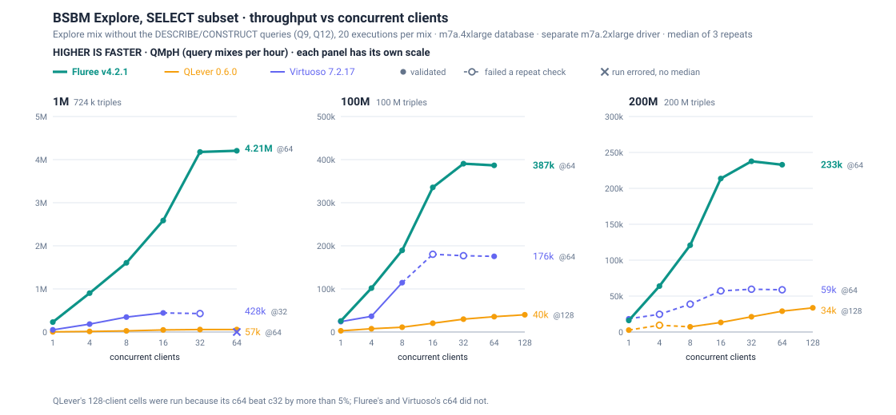
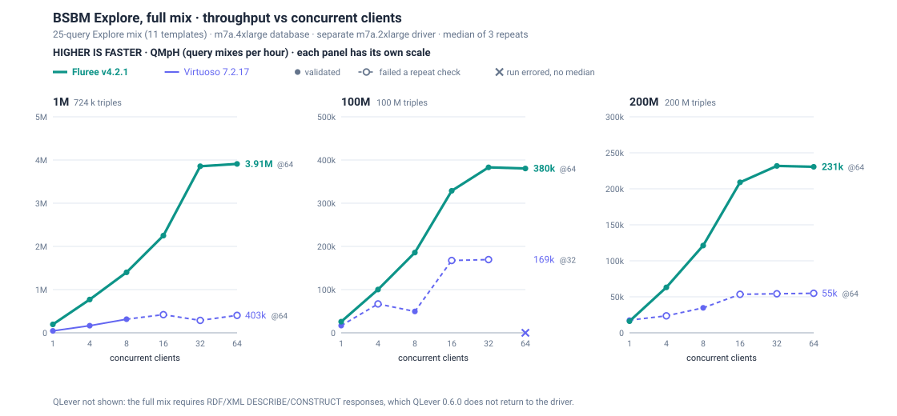
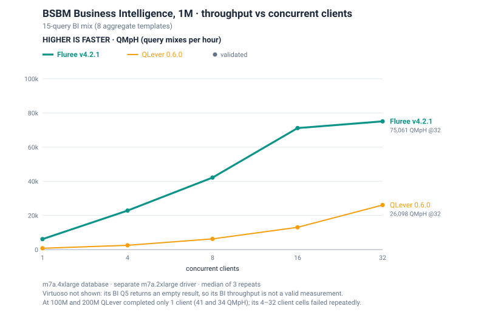
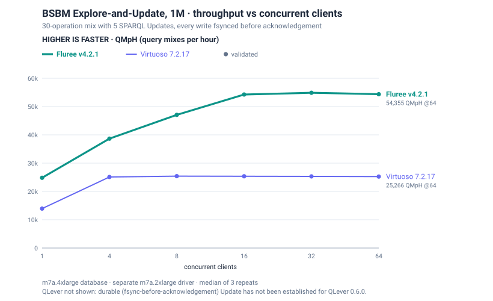

# BSBM — Berlin SPARQL Benchmark

**Fluree v4.2.1 completed every BSBM cell — Explore, the SELECT-only Explore subset,
Business Intelligence and Explore-and-Update at 1M, 100M and 200M triples — with zero
timeouts and zero driver errors.** At 100M triples, single-client Explore ran at
**25,705 QMpH** and peaked at **382,902 QMpH (2,659 queries/s)** with 32 clients, on one
AWS `m7a.4xlarge` (16 vCPU / 64 GiB) with fsync enabled. Measured September 12–13, 2026;
every figure is the median of three repeats.

[Summary grid](reports/v4.2.1/summary.tsv) ·
[Per-query latencies](reports/v4.2.1/per_query.tsv) ·
[Raw driver XML](reports/v4.2.1/runs/) ·
[Capacity protocol](capacity/README.md)

The [Berlin SPARQL Benchmark](http://wbsg.informatik.uni-mannheim.de/bizer/berlinsparqlbenchmark/)
(Bizer & Schultz) runs an **e-commerce** workload — products, vendors, offers,
reviews, reviewers — driven by BSBM's own Java test driver. Unlike
[SPARQLoscope](../sparqloscope/), which times fixed queries, BSBM measures
**throughput**: each client repeatedly runs a query mix whose templates are
re-instantiated with random parameters, and the driver reports **QMpH** (query
mixes per hour). QpS = QMpH × operations per mix / 3600.

## Compared with QLever and Virtuoso

**Fluree v4.2.1 had the highest validated throughput in every multi-client comparison
below.** On the SELECT-only Explore subset, Fluree's peak was **9.5×** Virtuoso 7.2.17's and
**72×** QLever 0.6.0's at 1M triples, and **2.2×** and **9.8×** at 100M. Single-client
results are closer: at 100M Fluree was 6% ahead of Virtuoso on the SELECT subset, and at
200M **Virtuoso was 13% faster** on the SELECT subset and 9% faster on the full Explore mix.
**QLever was 62% faster** on single-client BI at 200M.

All three engines ran the same pinned driver, datasets, seed, timeout and query mixes on the
same host types: an `m7a.4xlarge` database and a separate `m7a.2xlarge` driver per scale,
every cell the median of three repeats.









Filled points passed every check: three repeats finished, per-query result counts were
identical across repeats, and the spread was 5% or less. Hollow points on dashed segments
have a median but failed a check; ✕ marks a cell where a repeat errored, so there is no
median. Every cell and its status are in [`comparison.tsv`](reports/v4.2.1/comparison.tsv).

QMpH; **bold = fastest in the row**; the client count of each peak is in parentheses.

**Explore SELECT subset**

| scale | cell | Fluree v4.2.1 | QLever 0.6.0 | Virtuoso 7.2.17 |
|---|---|--:|--:|--:|
| 1M | 1 client | **228,783** | 3,337 | 50,083 |
| 1M | peak | **4,206,361** (64) | 58,328 (32) | 443,024 (16) |
| 100M | 1 client | **25,572** | 2,831 | 24,161 |
| 100M | peak | **390,576** (32) | 40,022 (128) | 175,510 (64) |
| 200M | 1 client | 16,145 | 2,637 | **18,309** |
| 200M | peak | **237,701** (32) | 33,642 (128) | no validated cell above 1 client |

**Full Explore mix** (Virtuoso only; validated Virtuoso cells)

| scale | clients | Fluree v4.2.1 | Virtuoso 7.2.17 |
|---|--:|--:|--:|
| 1M | 1 | **194,435** | 45,245 |
| 1M | 8 | **1,400,328** | 314,279 |
| 100M | 1 | **25,705** | 16,724 |
| 100M | 8 | **185,693** | 49,395 |
| 200M | 1 | 16,067 | **17,515** |
| 200M | 8 | **121,193** | 34,659 |

**Business Intelligence**

| scale | clients | Fluree v4.2.1 | QLever 0.6.0 | Virtuoso 7.2.17 |
|---|--:|--:|--:|--:|
| 1M | 1 | **6,141** | 775 | incorrect results |
| 1M | 32 | **75,061** | 26,098 | incorrect results |
| 100M | 1 | **52.3** | 41.0 | failed |
| 200M | 1 | 20.9 | **33.8** | failed |

**Explore-and-Update, 1M** (every write fsynced before acknowledgement)

| cell | Fluree v4.2.1 | Virtuoso 7.2.17 |
|---|--:|--:|
| 1 client | **24,835** | 13,940 |
| peak | **54,864** (32) | 25,405 (8) |

Coverage and caveats:

- **Virtuoso.** Most Explore and SELECT cells at 16+ clients, and at 200M from 4 clients,
  returned different per-query result counts across repeats or spread more than 5%; the
  1M SELECT and 100M full-Explore 64-client cells had an errored repeat. Its BI Q5 returns
  an empty result for every product type at 1M, so its BI throughput is not equivalent
  work ([details](reports/engine-comparison/BI-Q5-CORRECTNESS.md)); BI at 100M and 200M
  did not complete (Q4 timeouts).
- **QLever.** The full Explore mix needs RDF/XML `DESCRIBE`/`CONSTRUCT` responses that
  QLever 0.6.0 does not return to the driver, so it runs only the SELECT subset. BI at
  100M and 200M completed only at 1 client; the 4–32 client cells failed repeatedly.
  Update was not run: durable fsync-before-acknowledgement updates have not been
  established for QLever 0.6.0. Its SELECT 200M 4-client cell spread 10.7%.
- **Client counts.** QLever's 100M and 200M SELECT sweeps include 128 clients because its
  64-client throughput beat 32 clients by more than 5%; Fluree's and Virtuoso's did not.
- **Reproduce.** Engine setup is pinned in [`engines/README.md`](engines/README.md).
  `python3 reports/v4.2.1/collect_comparison.py` rebuilds `comparison.tsv` from the run
  archives; `python3 reports/v4.2.1/make_comparison_charts.py` redraws the charts.

## Results — Fluree v4.2.1

### Explore — QMpH

The 25-query Explore mix (11 active templates) of product lookups, reviews and offers.

| clients | 1M | 100M | 200M |
|--:|--:|--:|--:|
| 1 | 194,435 | 25,705 | 16,067 |
| 4 | 769,548 | 100,247 | 63,140 |
| 8 | 1,400,328 | 185,693 | 121,193 |
| 16 | 2,250,882 | 328,616 | 208,976 |
| 32 | 3,856,086 | **382,902** | **231,817** |
| 64 | **3,908,685** | 380,346 | 230,557 |

Throughput scales to 32 clients and plateaus there: c64 is within 1.4% of c32 at
every scale, so the protocol's optional 128-client point was not run. Peak
queries/s: 27,144 (1M), 2,659 (100M), 1,610 (200M).

### Explore SELECT subset — QMpH

The Explore mix without its two RDF-returning templates (Q9 `DESCRIBE`, Q12 `CONSTRUCT`):
20 SELECT queries per mix. It is the common read mix for engines that cannot return the
RDF/XML the full Explore mix requires.

| clients | 1M | 100M | 200M |
|--:|--:|--:|--:|
| 1 | 228,783 | 25,572 | 16,145 |
| 4 | 902,271 | 101,791 | 63,936 |
| 8 | 1,606,365 | 189,519 | 120,821 |
| 16 | 2,587,339 | 335,590 | 213,637 |
| 32 | 4,178,595 | **390,576** | **237,701** |
| 64 | **4,206,361** | 386,718 | 232,881 |

c64 is within 2.1% of c32 at every scale; no 128-client point was needed. Peak
queries/s: 23,369 (1M), 2,170 (100M), 1,321 (200M).

### Business Intelligence — QMpH

The 15-query BI mix (8 analytic GROUP BY / aggregate templates). At 100M and 200M
several BI queries aggregate over most of the dataset, so absolute QMpH is low.

| clients | 1M | 100M | 200M |
|--:|--:|--:|--:|
| 1 | 6,141 | 52.3 | 20.9 |
| 4 | 22,833 | 145.7 | 67.4 |
| 8 | 42,178 | 285.6 | 135.4 |
| 16 | 71,142 | 483.2 | 235.6 |
| 32 | **75,061** | **662.9** | **323.0** |

At 200M, 32 clients run up to seven simultaneous copies of the heaviest BI query
(Q8 over `ProductType1`). A dedicated validation run of that 32-client cell, before
the sweep, peaked at 28.7 GiB RSS on the 64 GiB server.

### Explore-and-Update

The 30-operation mix interleaves Explore reads with five SPARQL Updates. Mixed
operations/s counts every read and write in the mix; it is **not write TPS**.
Every write is fsynced before acknowledgement. Each figure is the median of three
complete runs, each starting from a fresh copy of the imported store.

| scale | clients | QMpH | mixed ops/s | range (ops/s) |
|---|--:|--:|--:|--:|
| 1M | 1 | 24,835 | 206.96 | 206.25–207.32 |
| 1M | 4 | 38,653 | 322.11 | 314.92–327.39 |
| 1M | 8 | 47,065 | 392.21 | 390.30–394.79 |
| 1M | 16 | 54,259 | 452.16 | 451.21–453.80 |
| 1M | 32 | **54,864** | **457.20** | 452.90–461.51 |
| 1M | 64 | 54,355 | 452.96 | 451.19–463.99 |
| 100M | 1 | 4,533 | 37.78 | 35.61–46.06 |
| 200M | 1 | 2,788 | 23.24 | 21.20–24.42 |

At 100M and 200M, Update ran **three full runs at one client** — 400 measured mixes
(12,000 operations) per run — with no multi-client sweep at those scales:

| scale | run 1 | run 2 | run 3 | median | measured seconds per run |
|---|--:|--:|--:|--:|--:|
| 100M | 35.61 | 46.06 | 37.78 | **37.78** | 337 / 261 / 318 |
| 200M | 23.24 | 24.42 | 21.20 | **23.24** | 516 / 491 / 566 |

Mixed ops/s. These runs vary more than the other cells (coefficient of variation
13.9% at 100M, 7.1% at 200M). Peak sampled server RSS was 38.0–38.6 GiB at 100M and
43.6–45.4 GiB at 200M.

### 100M single-client per-query latency

Median of the three repeats' average query execution times (ms). All scales,
workloads and client counts are in [`per_query.tsv`](reports/v4.2.1/per_query.tsv).

| Explore query | Q1 | Q2 | Q3 | Q4 | Q5 | Q7 | Q8 | Q9 | Q10 | Q11 | Q12 |
|---|--:|--:|--:|--:|--:|--:|--:|--:|--:|--:|--:|
| ms | 4.63 | 1.69 | 7.31 | 9.94 | 19.64 | 9.67 | 3.51 | 0.30 | 9.79 | 0.42 | 0.70 |

| BI query | Q1 | Q2 | Q3 | Q4 | Q5 | Q6 | Q7 | Q8 |
|---|--:|--:|--:|--:|--:|--:|--:|--:|
| ms | 3,155 | 112 | 3,030 | 1,749 | 13,270 | 602 | 2,001 | 14,504 |

## Validation

- **Completeness.** Every repeat of every cell finished with zero timeouts
  (300-second per-query cap) and no driver errors.
- **Repeatability.** Across three repeats, max − min is within 2.7% of the median for
  every Explore cell, 2.2% for the SELECT subset, 3.0% for BI and 3.9% for 1M Update.
  The 100M/200M Update exceptions are noted above. Every Explore and SELECT cell
  returned identical per-query result-count summaries across its repeats.
- **BI Q7 row counts.** Q7 ranks products by offer count and keeps the top 1,000,
  with no tie-breaker. Correct executions can therefore select different tied
  products and return different row counts, and the harness flags this as a repeat
  difference. An independent checker rebuilt the answer space from the N-Triples
  input and validated 55,560 (1M), 738 (100M) and 732 (200M) fresh Q7 responses
  from this release: all passed, checking product membership as well as row counts.
  These were fresh executions with the benchmark's parameters, not the timed
  responses themselves.
- **Update persistence.** After each Update run, the triple count was identical
  before and after a graceful restart (100M: 99,970,772; 200M: 200,001,707). These
  are graceful-restart checks, not power-loss tests.
- **Update result counts.** Per-query average result counts differed between some
  Update repeats (1M at 4+ clients; 100M and 200M at one client). Final triple
  counts matched exactly across all repeats.

## Method

Protocol details are in [`capacity/README.md`](capacity/README.md). In summary:

- **Hosts.** Database: AWS `m7a.4xlarge` (16 vCPU AMD EPYC, 64 GiB), 500 GB gp3
  (6,000 IOPS / 500 MiB/s), Ubuntu 24.04. The driver runs on a **separate**
  `m7a.2xlarge` in the same availability zone, one database/generator pair per scale.
  Only one measured workload runs per pair at a time, and each read cell starts a fresh
  server process followed by a triple-count check.
- **Driver.** bsbmtools v0.2 with a transport-only HTTP keep-alive patch
  (`capacity/prepare-driver.py`; query semantics unchanged), JDK 21, 24 GiB heap,
  seed 808080, 300-second query timeout.
- **Explore and SELECT subset.** A single-client qualification cell (1,000 warmup /
  100 measured mixes), then per client count 1,000 warmup mixes and a pilot-calibrated
  fixed mix count targeting about 180 seconds (minimum 120 s), three repeats at
  1/4/8/16/32/64 clients.
- **BI.** Two warmup mixes, then a pilot-calibrated count of at least 2 × clients
  mixes, three repeats at 1/4/8/16/32 clients. Cells ran 135–715 seconds.
- **Update.** Two mutating warmup mixes plus 400 measured mixes, three repeats. Each
  repeat restores an untouched store and runs a read preparation (1,000 warmup +
  100 measured SELECT mixes) first. Clients: 1/4/8/16/32/64 at 1M; 1 at 100M and 200M.
  The 100M/200M stores hold out 1,000 insert payloads (99,891,833 and 199,922,567
  starting triples).

### Build and environment

| | |
|---|---|
| Release | **Fluree v4.2.1**, release build with `mimalloc` |
| Server | `fluree server run --listen-addr 0.0.0.0:8182 --log-level warn` |
| Environment | `FLUREE_STORAGE_FSYNC=1`, `FLUREE_INDEXING_ENABLED=true`, `FLUREE_REINDEX_MIN_BYTES=2097152` (import and serving) |

### Datasets

Generated deterministically by bsbmtools v0.2 with forward chaining (`-fc`), N-Triples:

| scale | `-pc` | triples | SHA256 |
|---|--:|--:|---|
| 1M | 2,785 | 724,101 | `0eca9f19829be6390700196c5de4fe6e3d0610e1cd09d7f780de6526a95a48c8` |
| 100M | 284,826 | 100,000,748 | `9f72d493f1a8040558afdeb5b719dae9037625bb4911b36387a44746097707ba` |
| 200M | 570,000 | 200,031,975 | `6ded674926fe39153d557f2a059526723901edcea7232a8924bd7b49881936f8` |

### Other engines

QLever 0.6.0 and Virtuoso 7.2.17 results under this protocol are in
[Compared with QLever and Virtuoso](#compared-with-qlever-and-virtuoso); their pinned
setup is in [`engines/README.md`](engines/README.md). The June 2026
[engine comparison](reports/engine-comparison/REPORT.md) used older releases and an
earlier short-run protocol; it is kept for history and documents Virtuoso's incorrect
BI Q5 results.

## Run it

On the database host, from the repository root:

```bash
bash benchmarks/bsbm/setup-bsbmtools.sh
# 1M: bash benchmarks/bsbm/datasets/bsbm-1m/fetch-data.sh (writes datasets/bsbm-1m/td/).
# 100M shown; use -pc 570000 for 200M.
TD="$PWD/benchmarks/bsbm/datasets/bsbm-100m/td" && mkdir -p "$TD"
(cd benchmarks/bsbm/bsbmtools-0.2 && ./generate -fc -pc 284826 -s nt -dir "$TD" -fn "$TD/dataset")
python3 benchmarks/bsbm/engines/check-dataset.py 100m "$TD/dataset.nt" --output dataset-100m.json

export FLUREE_STORAGE_FSYNC=1 FLUREE_INDEXING_ENABLED=true FLUREE_REINDEX_MIN_BYTES=2097152
fluree init && fluree create bsbm --from "$TD/dataset.nt"
ulimit -n 1048576 && fluree server run --listen-addr 0.0.0.0:8182 --log-level warn
```

On the separate generator (same dataset and `td/` directory), build the keep-alive
driver once, then run cells:

```bash
python3 benchmarks/bsbm/capacity/prepare-driver.py
export BSBM_DATA="$PWD/benchmarks/bsbm/datasets/bsbm-100m/td" DB=http://DB_PRIVATE_IP:8182

python3 benchmarks/bsbm/capacity/run-cell.py --engine fluree --data "$BSBM_DATA" \
  --endpoint "$DB/v1/fluree/query/bsbm:main" \
  --workload explore --clients 32 --warmups 1000 --runs 19400 \
  --output results/fluree-100m-explore-c32-r1

python3 benchmarks/bsbm/capacity/run-cell.py --engine fluree --data "$BSBM_DATA" \
  --endpoint "$DB/v1/fluree/query/bsbm:main" \
  --update-endpoint "$DB/v1/fluree/update/bsbm:main" \
  --workload update --clients 1 --warmups 2 --runs 400 --minimum-seconds 0 \
  --output results/fluree-100m-update-c1-r1
```

`--runs 19400` is the calibrated 100M c32 count; use `--workload select` for the SELECT
subset. Calibrate other cells with the pilot formulas in the
[capacity protocol](capacity/README.md), which also covers BI, store snapshots for
Update and telemetry. The ledger-scoped query endpoint returns
`application/sparql-results+xml`, and the update endpoint accepts form-encoded
`update=…`; the driver talks to Fluree directly, with no adapter.

## Layout

```
setup-bsbmtools.sh       fetch + verify the pinned BSBM toolkit (generator + driver)
datasets/<scale>/        DATASET.md + fetch-data.sh (deterministic generator)
capacity/                sustained-throughput protocol, keep-alive driver, run-cell.py
engines/                 pinned Virtuoso / QLever setup for cross-engine runs
parse_bsbm_xml.py        benchmark_result.xml -> querymix_summary.tsv + per_query.tsv
run-*matrix.sh           earlier short-run sweeps (superseded by capacity/)
reports/v4.2.1/          summary.tsv, per_query.tsv, runs/<scale>/<workload>__c<N>__r<R>.xml
                         comparison.tsv (+ collect_comparison.py, make_comparison_charts.py)
reports/engine-comparison/  June 2026 cross-engine comparison (older releases)
```

## Provenance

- BSBM: <http://wbsg.informatik.uni-mannheim.de/bizer/berlinsparqlbenchmark/>
- Toolkit: bsbmtools v0.2 (Freie Universität Berlin), pinned in `setup-bsbmtools.sh`
  (SourceForge `bsbmtools-v0.2.zip`, sha256 `40f5e59b…`). Ships a prebuilt
  `lib/bsbm.jar` that runs on a modern JRE — no rebuild (its `build.xml` targets
  `-source 6`, which JDK 9+ rejects).
