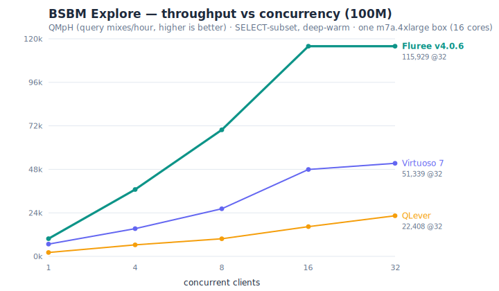

# BSBM engine comparison — Fluree vs Virtuoso vs QLever

> Run 2026-06-12/13 on one AWS m7a.4xlarge (16c / 64 GB, Ubuntu 24.04). All engines
> native (no Docker), driven by the same bsbmtools-0.2 `testdriver` over SPARQL-HTTP.
> Metric: **QMpH** (query mixes/hour, higher = faster). Co-measured on one machine; see
> `engines/README.md` for setup.

**Engines:** Fluree v4.0.6 · Virtuoso 7.2.5 (apt, tuned for 64 GB) ·
QLever (source build, master @ 2026-06-12). **Datasets:** BSBM 1M / 100M / 200M (`-fc`;
724,101 / 100,000,748 / 200,031,975 triples), identical across engines.

## Coverage

| use case | Fluree | Virtuoso | QLever |
|---|:--:|:--:|:--:|
| Explore (full 12-template mix) | ✓ | ✓ | ✗ |
| Explore (SELECT-only subset) | ✓ | ✓ | ✓ |
| Business Intelligence | ✓ | ✓ | ✓ |
| Explore-and-Update | ✓ | ✓ | ✗ |

QLever does not serve the full Explore mix (no RDF/XML output for the CONSTRUCT/DESCRIBE
queries the BSBM protocol requires) and has no update support. Virtuoso update requires
`GRANT SPARQL_UPDATE`. The **SELECT-subset** Explore mix (Q9 `DESCRIBE` + Q12 `CONSTRUCT`
removed) is run on all three engines for a like-for-like read comparison.

## 1. Explore — SELECT-subset, single-client (deep-warm)

QMpH, 0 timeouts. (×= times slower than the row leader.)

| scale | Fluree | Virtuoso | QLever |
|---|--:|--:|--:|
| 1M | **41,577** (1.0×) | 12,093 (3.4×) | 2,773 (15.0×) |
| 100M | **9,757** (1.0×) | 6,782 (1.4×) | 2,145 (4.5×) |
| 200M | 6,092 (1.06×) | **6,478** (1.0×) | 2,210 (2.9×) |

## 2. Explore — SELECT-subset, 100M concurrency ramp (deep-warm)

| clients | Fluree | Virtuoso | QLever |
|---|--:|--:|--:|
| 1 | 9,757 | 6,782 | 2,145 |
| 4 | 36,869 | 15,298 | 6,345 |
| 8 | 69,793 | 26,238 | 9,699 |
| 16 | 115,903 | 47,910 | 16,399 |
| 32 | **115,929** | 51,339 | 22,408 |

Ramp measured at the 100M scale only; 1M and 200M are single-client (§1). Chart:
`assets/bsbm-explore-scaling.svg` (regenerate with `make_explore_scaling_chart.py`).

## 3. Explore — full standard mix, single-client (deep-warm), Fluree + Virtuoso

Includes the DESCRIBE + CONSTRUCT queries; QLever does not run this mix. QMpH, 0 timeouts.

| scale | Fluree | Virtuoso |
|---|--:|--:|
| 1M | **40,301** | 10,898 |
| 100M | **10,204** | 7,415 |
| 200M | 6,090 | **6,781** |

## 4. Business Intelligence — single-client

QMpH; timeouts in parens (driver `-t` = 120 s). BI at 100M/200M is dominated by the
`-fc` root-type draw (`ProductType1` = all products → full scans), which affects all
engines.

| scale | Fluree | Virtuoso | QLever |
|---|--:|--:|--:|
| 1M | **2,993** (0 to) | 323 (0 to) | 716 (0 to) |
| 100M | 28.7 (0 to) | 26.5 (6 to) | 42.1 (3 to) |
| 200M | 12.3 (1 to) | 20.6 (3 to) | 35.2 (2 to) |

> **Read QMpH together with the timeout (`to`) counts:** at 100M/200M Virtuoso and
> QLever post higher QMpH *only because* their slowest queries time out (capped at
> 120 s in the mix) — and Virtuoso returns an empty Q5 (see §below). Fluree completes
> all 8 BI queries with 0–1 timeouts, so its lower QMpH reflects fully-returned results,
> not a slower engine on completed work.

BI 1M concurrency peak: Fluree 24,784 · Virtuoso 2,165 · QLever 1,501.

**Per-query AQET, BI @ 100M, single-client, same seed (808080)** — seconds; result rows
in parens:

| Q | Fluree | Virtuoso | QLever |
|---|--:|--:|--:|
| 1 | 7.06 (10) | 0.66 (10) | 0.23 (10) |
| 2 | 0.12 (10) | 0.07 (10) | 2.60 (10) |
| 3 | 8.51 (10) | 1.34 (10) | 0.25 (10) |
| 4 | 35.49 (10) | 120.00 (0, timeout) | 72.08 (5, timeout) |
| 5 | 15.38 (29) | 0.00 (0, empty) | 0.45 (29) |
| 6 | 0.88 (37) | 0.04 (37) | 0.14 (37) |
| 7 | 2.45 (83) | 0.09 (83) | 0.16 (84) |
| 8 | 19.63 (10) | 13.51 (10) | 5.61 (10) |

At 100M/200M Virtuoso returned 0 rows for Q4 (timed out) and Q5; Fluree and QLever
returned results for both. BI QMpH should therefore be read together with the timeout
and result-row counts, not in isolation.

**How QMpH treats a timeout** (verified in the bsbmtools-0.2 source): a timed-out query
is counted at the full `-t` value (120 s) in the mix runtime — it is not excluded, and
there is no penalty multiplier. Effectively every query is capped at 120 s for all
engines.

## 5. Explore-and-Update — 1M, Fluree + Virtuoso

QMpH (QLever has no update support). Full client grid:

| clients | Fluree | Virtuoso |
|---|--:|--:|
| 1 | 3,338 | 3,231 |
| 4 | 5,587 | 43,134 |
| 8 | 6,913 | 119,752 |
| 16 | 6,419 | 152,472 |
| 32 | 6,520 | 107,201 |

Caveats: (1) this run used shallow warm-up (`w2`); the multi-client per-query times
differ markedly between the cold c1 cell and the warmer higher-client cells, so the
multi-client figures are not directly comparable — the single-client row is the
like-for-like comparison. (2) BSBM's explore-and-update mix is read-heavy, so its QMpH is
not comparable to the read-only Explore QMpH.

## Summary (single-client)

- **Explore:** Fluree highest at 1M and 100M; Virtuoso highest at 200M (within ~6%).
- **BI:** Fluree highest at 1M. At 100M/200M Virtuoso and QLever post higher QMpH but
  with timeouts and (Virtuoso) empty Q5; Fluree completes all 8 queries (0–1 timeouts).
- **Update:** Fluree ≈ Virtuoso single-client (3,338 vs 3,231).

## Methodology

- **Deep warm-up (`-w 200 -runs 100`) for Explore**; shallow warm-up produced
  non-monotonic results across scale. BI and Update used lighter warm-up (BI queries run
  10–60 s, making deep warm-up impractical).
- **Published-number context:** the widely-cited ~47,000 QMpH Virtuoso/Explore/100M
  figure is the 2013 CWI run (256 GB cluster node, 2,000-mix warm-up). The
  commodity-hardware published figure is the 2011 run, 7,352 QMpH; our deep-warm Virtuoso
  measures 7,415 (full mix) / 6,782 (subset) at 100M single-client.
- Raw per-engine driver outputs: `summary.tsv` (this dir) + per-run XMLs. Engine setup
  scripts: `../../engines/`.
